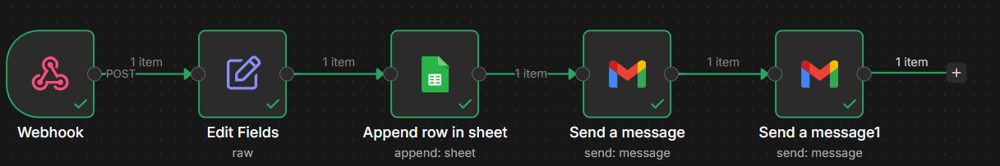

# TaskBridge Studio

TaskBridge Studio is a modern landing page for a tech-savvy admin and operations support service. It is designed to help potential clients inquire about admin support, documentation, scheduling, research, spreadsheets, digital tools, and workflow assistance.

The website is connected to an n8n automation workflow, so every inquiry submitted through the contact form is automatically processed.

## What the System Does

When a client submits the inquiry form on the website, the system automatically:

1. Receives the form submission through a Next.js API route
2. Sends the inquiry data to an n8n webhook
3. Cleans and prepares the submitted data
4. Saves the lead into Google Sheets
5. Sends an email notification to the business owner
6. Sends an automatic confirmation email to the client

This creates a simple but real lead capture and follow-up system for TaskBridge Studio.

## Automation Flow



## Tech Stack

### Frontend
- Next.js
- TypeScript
- Tailwind CSS
- Framer Motion

### UI / Assets
- Lucide React
- React Icons
- Custom images and logo assets

### Backend / API
- Next.js API Route
- Environment variable configuration

### Automation
- n8n Webhook
- n8n Edit Fields
- Google Sheets integration
- Gmail integration

### External Tools
- Google Sheets for lead tracking
- Gmail for email notification and auto-reply
- n8n Cloud for workflow automation

## Main Features

- Responsive landing page
- Modern hero section with image layout
- Animated sections and interactive UI
- Service highlights
- Tools section with icons
- Contact/inquiry form
- Custom dropdown selection
- Form validation with red error states
- Loading state to prevent duplicate submissions
- Success and error feedback messages
- n8n-powered lead automation

## Environment Variables

Create a `.env.local` file in the project root:

```env
N8N_WEBHOOK_URL=https://your-n8n-domain.com/webhook/taskbridge-lead